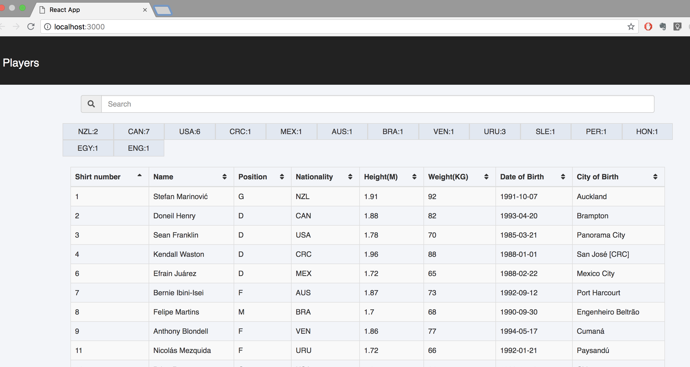
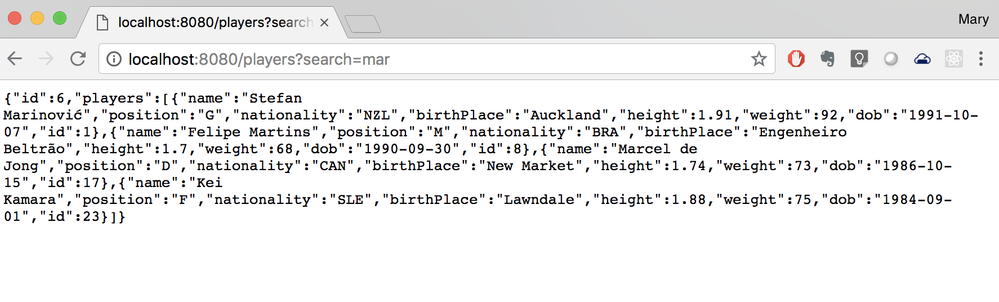

* Ubuntu 16.04
* OpenJDK Java Development Kit 1.8
* Maven
* NodeJs 8 (And NPM 5)
* Git
* Visual Studio Code
* Chrome and Firefox browsers

## Server

The server is a [DropWizard](http://www.dropwizard.io/) application that contains a database and provides REST endpoints that can read data from it. 

## Client

The client is a [React](https://reactjs.org/) application. 

The README in the `client` folder has instructions on how to build and start the client.

